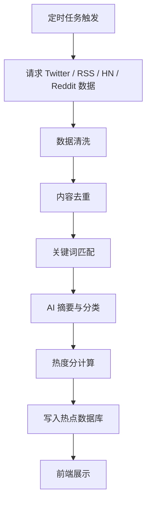
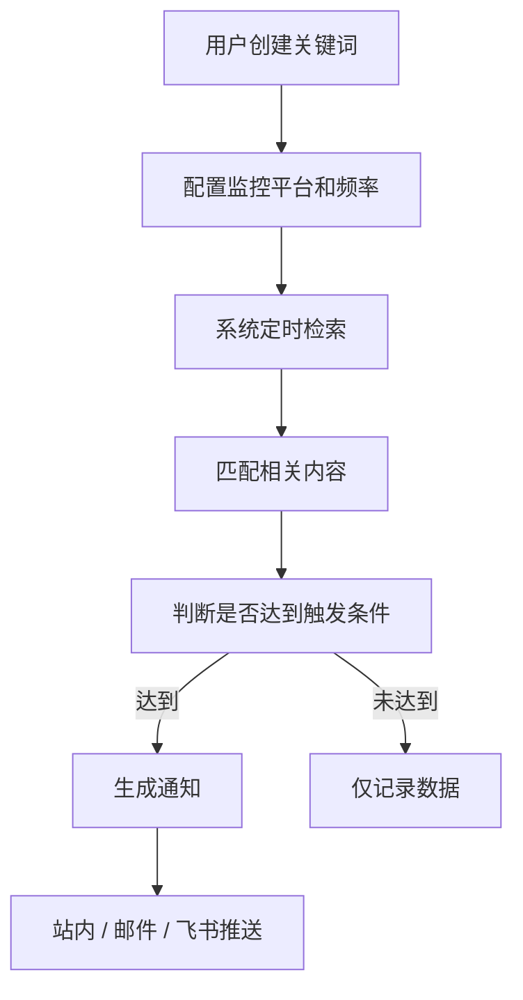
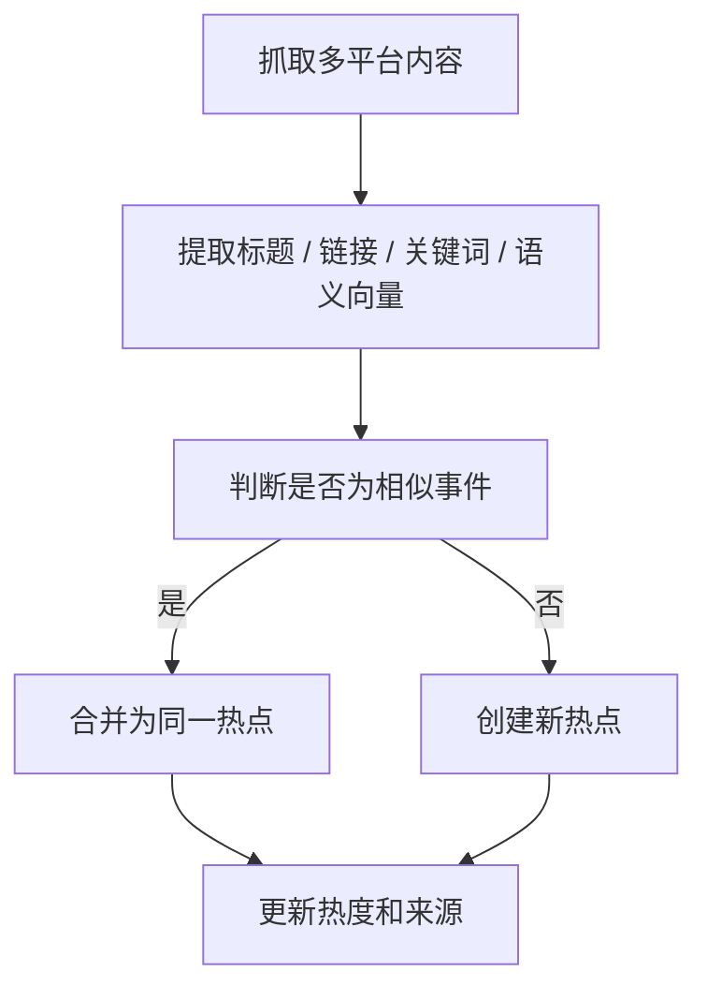
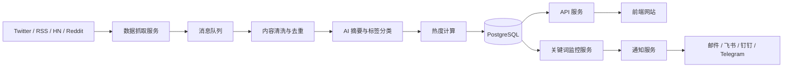

# AI Hot News 热点信息聚合网站 PRD

## 1. 项目背景

AI 时代信息迭代速度极快，新的模型、工具、产品、论文、融资、开源项目和行业观点每天都在大量涌现。
目前获取 AI 热点信息主要依赖人工刷 Twitter、RSS、HackerNews、Reddit 等平台，存在以下问题：

1. **信息分散**：热点内容分布在多个平台，需要频繁切换。
2. **筛选成本高**：大量重复、低价值、广告类内容混杂其中。
3. **时效性差**：人工查看容易错过热点爆发的最佳时间窗口。
4. **关键词监控不系统**：无法持续追踪特定公司、模型、技术方向或竞品动态。
5. **缺少沉淀**：热点信息看完即过，难以形成趋势分析和知识库。

因此，希望建设一个 AI 热点信息聚合网站，自动从主流信息源抓取 AI 相关热点内容，并支持关键词监控，帮助用户高效掌握 AI 行业动态。

---

## 2. 产品目标

打造一个面向 AI 从业者、开发者、产品经理、投资研究人员和内容创作者的 **AI 热点信息聚合与监控平台**。

核心目标：

1. **自动聚合热点**：从 Twitter、RSS、HackerNews、Reddit 等平台抓取 AI 相关信息。
2. **智能筛选排序**：通过热度、时间、互动量、来源权重等维度筛选高价值内容。
3. **关键词监控**：支持用户自定义关键词，持续监控相关动态。
4. **摘要与归类**：对热点信息进行 AI 摘要、标签分类和趋势归纳。
5. **及时推送**：当关键词或热点达到阈值时，自动通知用户。
6. **长期沉淀**：形成可搜索、可回溯的 AI 热点数据库。

---

## 3. 目标用户

### 3.1 核心用户

| 用户类型      | 需求                   |
| --------- | -------------------- |
| AI 产品经理   | 快速了解行业趋势、竞品动态、新功能方向  |
| AI 开发者    | 关注新模型、开源项目、技术文章和工具发布 |
| 内容创作者     | 获取选题灵感，追踪热门话题        |
| 投资 / 研究人员 | 观察公司动态、融资信息、技术趋势     |
| 运营 / 增长人员 | 捕捉热点，用于内容策划和营销传播     |
| 创业者       | 快速判断 AI 赛道变化和机会点     |

### 3.2 典型使用场景

1. 每天早上打开网站，浏览过去 24 小时 AI 行业热点。
2. 输入关键词，如 `OpenAI`、`Claude Code`、`AI Agent`、`Sora`，持续监控相关动态。
3. 当某个关键词突然在 Twitter / Reddit / HackerNews 上高频出现时，系统自动提醒。
4. 查看某个热点的来源、传播平台、热度变化和 AI 总结。
5. 定期生成 AI 热点日报、周报，用于团队同步或个人学习。

---

## 4. 产品定位

**一句话定位：**

> 一个自动聚合 Twitter、RSS、HackerNews、Reddit 等平台 AI 热点，并支持关键词监控和 AI 摘要分析的信息平台。

**产品关键词：**

* AI 热点聚合
* 多平台信息监控
* 关键词追踪
* AI 摘要
* 趋势发现
* 行业情报
* 自动推送

---

## 5. 核心功能范围

## 5.1 热点信息聚合

### 功能说明

系统定时从多个主流平台抓取 AI 相关内容，并统一展示在网站中。

### 支持平台

| 平台          | 信息类型                              | 示例                                          |
| ----------- | --------------------------------- | ------------------------------------------- |
| Twitter / X | 推文、账号动态、关键词搜索结果                   | OpenAI 发布新模型、AI 工具讨论                        |
| RSS         | 博客、媒体、官方公告                        | OpenAI Blog、Anthropic News、Google AI Blog   |
| HackerNews  | 热门技术讨论                            | 新开源项目、AI 工具、论文讨论                            |
| Reddit      | 社区讨论                              | r/LocalLLaMA、r/MachineLearning、r/artificial |
| 后续扩展        | GitHub、Product Hunt、YouTube、arXiv | 开源项目、产品发布、论文                                |

### 抓取策略

1. 定时轮询不同平台数据。
2. 支持平台级别的抓取频率配置。
3. 对抓取结果进行去重、清洗、分类。
4. 根据热度算法计算内容权重。
5. 将高价值内容进入热点池。

### 信息字段

| 字段      | 说明                    |
| ------- | --------------------- |
| 标题 / 内容 | 原始内容标题或正文摘要           |
| 原始链接    | 跳转到原平台                |
| 来源平台    | Twitter、RSS、HN、Reddit |
| 作者 / 账号 | 内容发布者                 |
| 发布时间    | 原始发布时间                |
| 抓取时间    | 系统抓取时间                |
| 互动数据    | 点赞、转发、评论、投票等          |
| 关键词命中   | 命中的 AI 关键词            |
| AI 标签   | 模型、工具、Agent、开源、融资等    |
| AI 摘要   | 对内容进行简要总结             |
| 热度分     | 系统计算的综合分数             |

---

## 5.2 热点列表页

### 页面目标

让用户快速浏览当前最值得关注的 AI 热点。

### 页面模块

1. **顶部筛选区**

   * 时间范围：1小时 / 6小时 / 24小时 / 7天
   * 来源平台：全部 / Twitter / RSS / HN / Reddit
   * 内容类型：模型发布 / 工具产品 / 技术文章 / 开源项目 / 行业观点 / 融资动态
   * 排序方式：综合热度 / 最新发布 / 互动最高 / 增速最快

2. **热点卡片列表**

   * 标题
   * AI 摘要
   * 来源平台
   * 作者
   * 发布时间
   * 热度分
   * 互动数据
   * 命中关键词
   * 查看原文按钮
   * 收藏按钮

3. **热点详情**

   * 原始内容
   * AI 摘要
   * 相关链接
   * 相关讨论
   * 相似内容聚合
   * 热度变化趋势
   * 来源分布

### 热点卡片示例

```text
标题：OpenAI releases new coding model for developers

摘要：OpenAI 发布了新的代码生成模型，开发者讨论集中在性能、价格和与 Claude Code 的对比上。

来源：Twitter / HackerNews
热度：92
发布时间：2 小时前
标签：OpenAI、Coding Agent、Developer Tool
```

---

## 5.3 关键词监控

### 功能说明

用户可以输入自己关注的关键词，系统会持续从各平台监控相关内容，并在达到规则时提醒用户。

### 关键词示例

* OpenAI
* ChatGPT
* Claude Code
* Gemini
* Sora
* AI Agent
* Cursor
* Devin
* Vibe Coding
* Local LLM
* Stable Diffusion
* AI Photo Editor
* Evoto
* Midjourney

### 关键词监控配置

| 配置项  | 说明                                    |
| ---- | ------------------------------------- |
| 关键词  | 用户输入的监控词                              |
| 同义词  | 可配置相关词，如 Claude Code / Anthropic Code |
| 排除词  | 过滤无关内容                                |
| 来源平台 | 可选择 Twitter、RSS、HN、Reddit             |
| 监控频率 | 15分钟 / 30分钟 / 1小时 / 每天                |
| 触发条件 | 新内容出现 / 热度超过阈值 / 讨论量突然上升              |
| 推送方式 | 站内通知 / 邮件 / 飞书 / 钉钉 / Telegram        |
| 状态   | 启用 / 停用                               |

### 监控规则示例

```text
关键词：Claude Code
监控平台：Twitter、HackerNews、Reddit
频率：30分钟一次
触发条件：
1. 30分钟内出现超过 10 条相关内容
2. 单条内容热度分超过 80
3. HackerNews 上榜
推送方式：站内通知 + 飞书
```

---

## 5.4 AI 摘要与标签分类

### 功能说明

系统对抓取到的内容进行 AI 处理，帮助用户快速理解信息价值。

### AI 处理能力

1. **一句话摘要**

   * 快速说明这条内容在讲什么。

2. **重点提炼**

   * 提炼发布时间、涉及产品、关键观点、潜在影响。

3. **标签分类**

   * 自动识别内容所属类别。

4. **情绪 / 立场判断**

   * 判断社区反馈偏正面、负面还是中性。

5. **相似内容合并**

   * 同一个热点可能出现在多个平台，需要合并成一个事件。

### 标签示例

| 标签类型 | 示例                           |
| ---- | ---------------------------- |
| 公司   | OpenAI、Anthropic、Google、Meta |
| 模型   | GPT、Claude、Gemini、Llama      |
| 类型   | 模型发布、开源项目、产品更新、融资、争议、教程      |
| 技术方向 | Agent、RAG、多模态、图像生成、视频生成、本地模型 |
| 热点级别 | 普通、热门、爆发                     |

---

## 5.5 热点趋势分析

### 功能说明

对一定时间范围内的信息进行聚合分析，帮助用户判断趋势。

### 分析维度

1. 过去 24 小时最热 AI 话题。
2. 过去 7 天增长最快关键词。
3. 各平台讨论热度分布。
4. 不同公司 / 产品的声量变化。
5. 某个关键词的历史趋势。
6. 热点事件传播路径。

### 示例

```text
过去 24 小时 AI 热点 Top 5：

1. Claude Code 新版本发布
2. OpenAI 新模型 API 价格讨论
3. Cursor 新功能引发开发者热议
4. Local LLM 部署工具爆火
5. AI Agent 在企业自动化场景中的讨论升温
```

---

## 5.6 搜索与内容库

### 功能说明

所有抓取和处理后的内容进入数据库，支持后续搜索和回溯。

### 搜索能力

1. 按关键词搜索。
2. 按平台搜索。
3. 按时间范围搜索。
4. 按标签搜索。
5. 按热度分搜索。
6. 按作者 / 账号搜索。
7. 支持组合筛选。

### 使用场景

* 查看过去 30 天 `AI Agent` 的讨论变化。
* 搜索某个 AI 工具第一次爆火的时间点。
* 查询某家公司最近是否有异常高频讨论。
* 为周报、文章、竞品分析提供素材。

---

## 5.7 推送通知

### 功能说明

当热点或关键词满足触发条件时，系统自动推送提醒。

### 推送渠道

| 渠道           | 优先级 |
| ------------ | --- |
| 站内通知         | P0  |
| 邮件           | P1  |
| 飞书 / 钉钉      | P1  |
| Telegram Bot | P2  |
| Webhook      | P2  |

### 推送内容

1. 热点标题
2. AI 摘要
3. 来源平台
4. 热度分
5. 关键词命中
6. 原文链接
7. 详情页链接

### 推送示例

```text
【AI热点提醒】

关键词：Claude Code
平台：HackerNews / Twitter
热度：89

摘要：Claude Code 新版本发布后，开发者主要讨论其代码理解能力、上下文长度和与 Cursor 的差异。

查看详情：https://xxx.com/hot-news/123
```

---

## 6. 页面结构

## 6.1 首页

### 模块

1. 今日 AI 热点
2. 热点 Top 10
3. 增长最快关键词
4. 平台来源分布
5. 最新抓取内容
6. 我的关键词监控
7. AI 日报入口

---

## 6.2 热点列表页

### 功能

1. 热点筛选
2. 热点排序
3. 热点卡片展示
4. 收藏 / 标记已读
5. 进入详情页

---

## 6.3 热点详情页

### 功能

1. 原文内容展示
2. AI 摘要
3. 热点分析
4. 相关内容聚合
5. 来源平台列表
6. 互动数据
7. 趋势图
8. 一键收藏
9. 一键生成分享文案

---

## 6.4 关键词监控页

### 功能

1. 新增关键词
2. 编辑关键词规则
3. 停用 / 删除关键词
4. 查看关键词命中记录
5. 查看关键词趋势
6. 配置推送方式

---

## 6.5 趋势分析页

### 功能

1. 热门关键词趋势
2. 平台热度趋势
3. 公司 / 产品声量分析
4. 时间范围筛选
5. 数据图表展示

---

## 6.6 内容库 / 搜索页

### 功能

1. 全局搜索
2. 条件筛选
3. 历史数据查看
4. 导出数据
5. 收藏内容管理

---

## 7. 核心流程

## 7.1 热点信息抓取流程



---

## 7.2 关键词监控流程



---

## 7.3 热点合并流程



---

## 8. 热度计算规则

### 8.1 热度分组成

热点分可以由以下因素组成：

| 指标      | 说明                 | 权重示例 |
| ------- | ------------------ | ---- |
| 发布时间    | 越新的内容权重越高          | 20%  |
| 互动数据    | 点赞、转发、评论、投票等       | 30%  |
| 来源权重    | 官方账号、头部社区、知名媒体权重更高 | 20%  |
| 跨平台出现次数 | 多平台同时出现说明事件更重要     | 15%  |
| 关键词命中   | 命中核心 AI 关键词加权      | 10%  |
| 增长速度    | 短时间内讨论量快速上升        | 5%   |

### 8.2 公式示例

```text
热度分 = 时间分 * 0.2 
      + 互动分 * 0.3 
      + 来源权重 * 0.2 
      + 跨平台传播分 * 0.15 
      + 关键词匹配分 * 0.1 
      + 增速分 * 0.05
```

### 8.3 热点等级

| 热点等级 | 分数范围     | 说明              |
| ---- | -------- | --------------- |
| 爆发   | 90 - 100 | 多平台高频出现，短时间快速传播 |
| 热门   | 70 - 89  | 单平台或多平台有较高讨论    |
| 普通   | 40 - 69  | 有一定价值，但传播一般     |
| 低热度  | 0 - 39   | 暂不推荐展示在首页       |

---

## 9. 数据来源设计

## 9.1 Twitter / X

### 采集内容

1. 关键词搜索结果
2. 指定账号动态
3. 热门推文
4. 转发 / 评论 / 点赞数据

### 重点监控账号示例

* OpenAI
* Anthropic
* Google DeepMind
* Meta AI
* Perplexity
* Cursor
* Hugging Face
* Andrej Karpathy
* Sam Altman
* Greg Brockman
* Demis Hassabis

---

## 9.2 RSS

### 采集内容

1. 官方博客
2. 科技媒体
3. AI 公司新闻
4. 技术博客

### RSS 源示例

* OpenAI Blog
* Anthropic News
* Google AI Blog
* DeepMind Blog
* Hugging Face Blog
* The Verge AI
* TechCrunch AI
* VentureBeat AI
* arXiv AI RSS

---

## 9.3 HackerNews

### 采集内容

1. 首页热门内容
2. `Ask HN`
3. `Show HN`
4. 指定关键词搜索结果
5. 评论区讨论

### 适合发现

* 开源工具
* 技术争议
* 开发者工具
* 新产品发布
* 技术深度讨论

---

## 9.4 Reddit

### 采集内容

1. 指定 subreddit 热门帖
2. 指定关键词搜索结果
3. 评论区讨论

### 推荐 subreddit

* r/LocalLLaMA
* r/MachineLearning
* r/artificial
* r/OpenAI
* r/ChatGPT
* r/singularity
* r/StableDiffusion
* r/ClaudeAI

---

## 10. 后台管理功能

## 10.1 数据源管理

1. 添加 / 删除 RSS 源。
2. 配置 Twitter 监控账号。
3. 配置 Reddit subreddit。
4. 配置平台抓取频率。
5. 查看数据源状态。
6. 查看最近抓取成功 / 失败记录。

## 10.2 关键词管理

1. 维护系统默认 AI 关键词。
2. 配置关键词权重。
3. 配置同义词。
4. 配置屏蔽词。
5. 配置关键词分类。

## 10.3 内容管理

1. 查看抓取内容列表。
2. 手动隐藏低质量内容。
3. 手动合并相似热点。
4. 编辑 AI 摘要。
5. 编辑标签。
6. 标记内容质量。

## 10.4 推送管理

1. 配置推送渠道。
2. 配置推送模板。
3. 查看推送记录。
4. 查看推送失败原因。

---

## 11. 权限与账号体系

### 11.1 未登录用户

1. 查看公开热点列表。
2. 查看部分热点详情。
3. 使用基础搜索。

### 11.2 登录用户

1. 创建关键词监控。
2. 收藏热点。
3. 配置推送方式。
4. 查看个人监控记录。
5. 生成个人 AI 日报。

### 11.3 管理员

1. 管理数据源。
2. 管理关键词库。
3. 管理内容质量。
4. 管理用户权限。
5. 查看系统运行状态。

---

## 12. 非功能需求

## 12.1 性能要求

1. 首页首屏加载时间控制在 2 秒以内。
2. 热点列表支持分页或虚拟滚动。
3. 抓取任务异步执行，不影响前端访问。
4. 关键词监控任务支持队列化处理。
5. 热点数据支持缓存，降低数据库压力。

## 12.2 稳定性要求

1. 单个平台抓取失败不影响其他平台。
2. 抓取任务失败后支持重试。
3. API 限流时自动降级。
4. 推送失败后记录失败原因并支持重试。
5. 定时任务需要有日志和告警。

## 12.3 安全要求

1. API Key 加密存储。
2. 用户数据隔离。
3. 防止恶意关键词刷请求。
4. 管理后台需要权限校验。
5. 对外接口需要限流。

## 12.4 可扩展性要求

1. 数据源接入采用插件化设计。
2. 新增平台时不影响现有抓取逻辑。
3. 热度算法支持配置化调整。
4. AI 摘要模型支持替换。
5. 推送渠道支持扩展。

---

## 13. MVP 版本规划

## 13.1 V0.1：基础热点聚合版

### 目标

先跑通数据抓取、清洗、展示的主链路。

### 功能范围

1. 接入 RSS。
2. 接入 HackerNews。
3. 接入 Reddit。
4. 首页热点列表。
5. 热点详情页。
6. 基础关键词匹配。
7. AI 摘要。
8. 基础热度排序。

### 暂不做

1. Twitter 深度接入。
2. 复杂推送规则。
3. 趋势图表。
4. 多用户权限体系。
5. 复杂后台管理。

---

## 13.2 V0.2：关键词监控版

### 目标

支持用户自定义关键词，并能持续监控。

### 功能范围

1. 用户登录。
2. 创建关键词。
3. 配置监控平台。
4. 查看关键词命中记录。
5. 站内通知。
6. 邮件推送。
7. 关键词趋势展示。

---

## 13.3 V0.3：Twitter / X 接入版

### 目标

接入 Twitter / X，提高热点发现能力。

### 功能范围

1. 支持关键词搜索。
2. 支持指定账号监控。
3. 支持推文互动数据获取。
4. 支持推文进入热点排序。
5. 支持跨平台热点合并。

---

## 13.4 V0.4：趋势分析版

### 目标

从“信息聚合”升级为“趋势洞察”。

### 功能范围

1. 热门关键词趋势。
2. 热点传播路径。
3. 平台声量对比。
4. 公司 / 产品声量分析。
5. 自动生成 AI 日报 / 周报。

---

## 14. 数据模型设计

## 14.1 HotNews 热点表

```ts
interface HotNews {
  id: string;
  title: string;
  summary: string;
  content: string;
  sourcePlatform: 'twitter' | 'rss' | 'hackernews' | 'reddit';
  sourceUrl: string;
  author?: string;
  publishedAt: string;
  crawledAt: string;
  heatScore: number;
  tags: string[];
  keywords: string[];
  interactionCount?: {
    likes?: number;
    reposts?: number;
    comments?: number;
    upvotes?: number;
  };
  status: 'visible' | 'hidden' | 'pending';
}
```

---

## 14.2 KeywordMonitor 关键词监控表

```ts
interface KeywordMonitor {
  id: string;
  userId: string;
  keyword: string;
  synonyms: string[];
  excludeWords: string[];
  platforms: string[];
  frequency: '15m' | '30m' | '1h' | '1d';
  triggerRules: {
    minCount?: number;
    minHeatScore?: number;
    growthRate?: number;
  };
  notifyChannels: string[];
  enabled: boolean;
  createdAt: string;
  updatedAt: string;
}
```

---

## 14.3 SourceConfig 数据源配置表

```ts
interface SourceConfig {
  id: string;
  platform: 'twitter' | 'rss' | 'hackernews' | 'reddit';
  name: string;
  url?: string;
  keyword?: string;
  enabled: boolean;
  crawlInterval: number;
  lastCrawledAt?: string;
  status: 'normal' | 'failed' | 'limited';
}
```

---

## 15. 技术方案建议

## 15.1 前端

建议技术栈：

* Next.js / Nuxt
* TypeScript
* Tailwind CSS
* React Query / TanStack Query
* ECharts / Recharts
* Zustand / Pinia

核心页面：

1. 首页
2. 热点列表页
3. 热点详情页
4. 关键词监控页
5. 趋势分析页
6. 后台管理页

---

## 15.2 后端

建议技术栈：

* Node.js / NestJS
* PostgreSQL
* Redis
* BullMQ / 队列任务
* Prisma
* OpenAI / Claude / Gemini API
* 定时任务调度器

核心服务：

1. 数据抓取服务
2. 内容清洗服务
3. AI 摘要服务
4. 热度计算服务
5. 关键词监控服务
6. 推送通知服务
7. 用户服务

---

## 15.3 系统架构



---

## 16. 核心指标

## 16.1 产品指标

| 指标     | 说明           |
| ------ | ------------ |
| DAU    | 每日活跃用户       |
| 热点点击率  | 用户点击热点详情的比例  |
| 收藏率    | 用户收藏热点内容的比例  |
| 关键词创建数 | 用户创建监控关键词数量  |
| 推送打开率  | 用户收到通知后的打开比例 |
| 搜索次数   | 用户主动检索内容的次数  |
| 日报生成次数 | 用户使用日报能力的次数  |

## 16.2 内容质量指标

| 指标    | 说明               |
| ----- | ---------------- |
| 有效热点率 | 抓取内容中被用户点击或收藏的比例 |
| 重复率   | 相同事件重复展示的比例      |
| 摘要准确率 | AI 摘要是否准确        |
| 标签准确率 | AI 分类是否正确        |
| 推送命中率 | 推送内容是否符合用户关注点    |

## 16.3 系统指标

| 指标      | 说明              |
| ------- | --------------- |
| 抓取成功率   | 各平台数据抓取是否稳定     |
| 抓取延迟    | 原平台发布到网站展示的时间差  |
| API 错误率 | 服务接口失败比例        |
| 推送成功率   | 通知发送成功比例        |
| 队列积压数   | 抓取和 AI 处理任务是否堆积 |

---

## 17. 风险与应对

| 风险              | 说明            | 应对方案                                |
| --------------- | ------------- | ----------------------------------- |
| Twitter API 成本高 | 官方 API 价格可能较高 | MVP 先接 RSS / HN / Reddit，Twitter 后接 |
| 平台限流            | 高频抓取可能触发限制    | 使用队列、缓存、限频、失败重试                     |
| 内容重复            | 多平台会讨论同一热点    | 做 URL 去重 + 语义相似度合并                  |
| AI 摘要不准确        | 摘要可能误解原文      | 保留原文链接，支持人工编辑                       |
| 热度算法不准          | 早期排序可能不符合预期   | 支持权重配置，结合用户行为优化                     |
| 推送打扰用户          | 过多通知影响体验      | 支持阈值、频率和免打扰配置                       |
| 数据合规风险          | 抓取平台内容需遵守规则   | 优先使用官方 API / RSS / 合规数据源            |

---

## 18. 优先级建议

### P0 必做

1. RSS 数据接入
2. HackerNews 数据接入
3. Reddit 数据接入
4. 热点列表
5. 热点详情
6. 基础关键词匹配
7. AI 摘要
8. 热度排序
9. 数据去重

### P1 重要

1. 用户关键词监控
2. 站内通知
3. 邮件推送
4. 标签分类
5. 收藏功能
6. 搜索功能
7. 热点趋势图

### P2 后续增强

1. Twitter / X 深度接入
2. 飞书 / 钉钉 / Telegram 推送
3. 自动生成日报 / 周报
4. 传播路径分析
5. 竞品声量分析
6. GitHub / Product Hunt / arXiv 接入
7. 浏览器插件

---

## 19. 可做的差异化能力

后续可以进一步做成不只是“信息聚合站”，而是“AI 行业情报系统”。

### 19.1 AI 热点日报

每天自动生成：

```text
今日 AI 热点日报

1. 今日最热事件
2. 新产品 / 新模型发布
3. 开源项目推荐
4. 开发者社区讨论
5. 投融资动态
6. 值得关注的趋势
```

### 19.2 竞品监控

支持输入竞品名称，比如：

* Cursor
* Claude Code
* Perplexity
* Midjourney
* Runway
* Evoto

系统自动追踪竞品新闻、用户讨论、功能发布和负面反馈。

### 19.3 趋势预警

当某个关键词在短时间内出现异常增长时，自动识别为潜在热点。

例如：

```text
关键词：Vibe Coding
过去 3 小时讨论量增长 320%
主要来源：Twitter、HackerNews
建议关注：可能成为新的开发者工具趋势
```

### 19.4 自动生成内容选题

基于热点生成：

1. 小红书选题
2. Twitter thread
3. 博客标题
4. 周报素材
5. 公众号文章大纲

---

## 20. 总结

AI Hot News 的核心价值是：

> 用自动化和 AI 摘要能力，替代人工刷信息，帮助用户更快发现 AI 行业热点、追踪关键词动态，并沉淀长期趋势数据。

MVP 阶段建议优先完成：

1. **RSS + HackerNews + Reddit 数据聚合**
2. **热点列表和详情页**
3. **关键词监控**
4. **AI 摘要**
5. **基础热度排序**

Twitter / X 可以作为后续重点能力接入，因为它的信息价值高，但 API 成本、限流和合规复杂度也更高。先用 RSS、HN、Reddit 跑通产品闭环，再接入 Twitter，会更稳妥。
