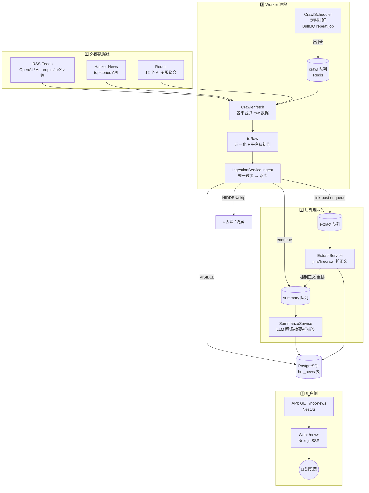
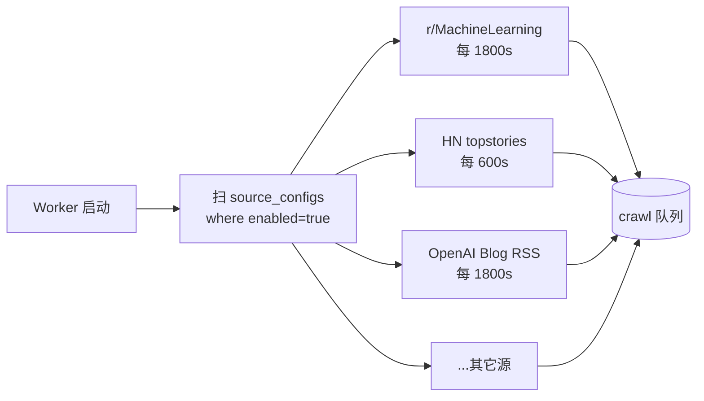
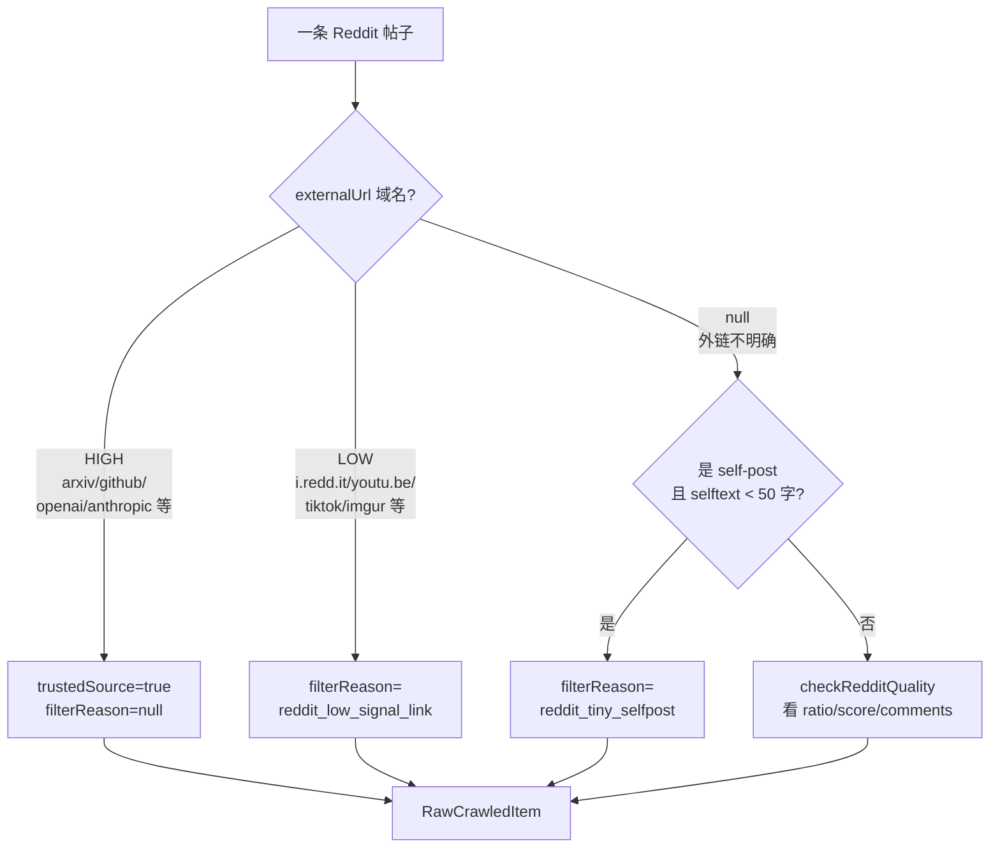
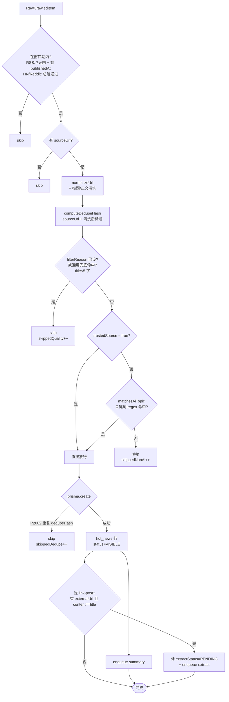
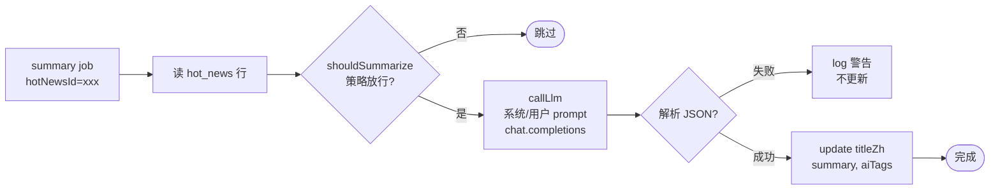
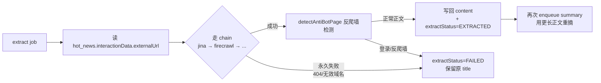
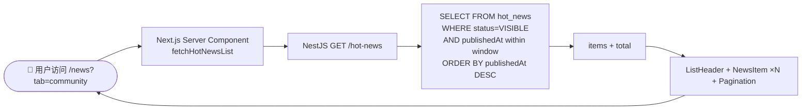

# 数据流水线：从抓取到上架

> 本文用大白话讲清楚一条新闻从外网抓回来、被过滤、被翻译总结、最后展示在网页上的全过程。
>
> 适用范围：`ai-hot-news` 仓库（Worker / API / Web 三件套），状态截至 SP-5.5（2026-05-09）。
>
> 阅读顺序：先看 §1 总览图把整体串起来，再按 §2~§7 一段段细看。

---

## 1. 一图全览




四步：**抓 → 滤 → 译 → 展**。下面拆开讲。

---

## 2. 第一步：定时排班 + 抓取（Worker · `crawl` 队列）

### 2.1 谁负责派活

`apps/worker/src/crawl/crawl.scheduler.ts`：Worker 启动时一次性扫描 `source_configs` 表里所有 `enabled = true` 的源，按每个源自己的 `crawlInterval`（秒）注册一个 BullMQ **repeat job**，外加一个立即跑一次的 boot job。




> **关键点**：源开关是数据库里的 `enabled` 字段，不是写死在代码里。所以禁用一个 subreddit 等于改一行 SQL（或者跑一次性脚本，比如 SP-5.5 的 `sp5-5-source-migrations.ts`）。

### 2.2 谁负责抓数据

`crawl.processor.ts` 拿到一个 job → `CrawlerFactory` 按 `platform` 实例化对应的 crawler：


| Platform     | 实现文件                             | 数据来源                                                          |
| ------------ | -------------------------------- | ------------------------------------------------------------- |
| `RSS`        | `crawlers/rss.crawler.ts`        | 标准 RSS/Atom feed                                              |
| `HACKERNEWS` | `crawlers/hackernews.crawler.ts` | `https://hacker-news.firebaseio.com` JSON API                 |
| `REDDIT`     | `crawlers/reddit.crawler.ts`     | `https://www.reddit.com/r/<sub>/hot.json`（多 sub bundle 拼 URL） |


每个 crawler 都实现两个方法：

- `fetch()`：拉原始数据（HTTP 请求 + 反爬重试）。
- `toRaw(item)`：把平台特有结构 → 统一的 `RawCrawledItem`（`packages/types/src/dtos.ts`）。

### 2.3 平台级初判（在 `toRaw` 里就先打标）

平台相关的"好坏判断"放在 crawler 里，不放在统一的 `IngestionService`。这样不同平台的特殊规则（比如 Reddit 的域名信号）不会污染主流程。

#### Reddit `toRaw`（SP-5.5 之后）




四级金字塔：**HIGH 直通 → LOW 直拒 → 短自帖直拒 → 看互动数据兜底**。
互动门槛回到 SP-3 噪声地板（`upvote_ratio < 0.5` 或 `score < 5 且 comments < 2`），不靠它筛精品，靠它扫垃圾。

#### Hacker News `toRaw`

只有一档：`checkHnQuality({score, descendants, position})` —— 头部 20 名直通；其余看 `score >= 5 且 descendants >= 1`。

#### RSS `toRaw`

不打 `filterReason`，由下游 `IngestionService` 跑通用兜底（`checkUniversalQuality`：标题 < 5 字直拒）。

> 重点：`toRaw` 阶段已经决定"这条要不要入库"。crawler 把判决以 `filterReason` / `trustedSource` 字段挂在 `RawCrawledItem` 上，往下游传。

---

## 3. 第二步：统一过滤 + 落库（`IngestionService.ingest`）

`apps/worker/src/crawl/ingestion.service.ts`：所有平台抓回来的 `RawCrawledItem[]` 都进这个漏斗。一个一个 item 跑下面这条流水线：




逐项对照表：


| 步骤      | 拒绝原因（`filterReason` 取值）                                                                                                | 谁来打                                      |
| ------- | ---------------------------------------------------------------------------------------------------------------------- | ---------------------------------------- |
| RSS 窗口期 | `(直接 skip，不写库)`                                                                                                        | `IngestionService`                       |
| 平台质量    | `reddit_low_ratio` / `reddit_low_engagement` / `reddit_low_signal_link` / `reddit_tiny_selfpost` / `hn_low_engagement` | crawler.`toRaw`                          |
| 通用兜底    | `title_too_short`                                                                                                      | `IngestionService.checkUniversalQuality` |
| AI 主题门  | `(直接 skip，不写库；trustedSource=true 时跳过)`                                                                                 | `IngestionService.matchesAiTopic`        |
| 去重      | `(P2002 唯一约束冲突自动 skip)`                                                                                                | DB 唯一索引（`dedupeHash` + `sourceUrl`）      |


> 注意所有"被拒绝"的 item **不会进 `hot_news` 表**。早期版本会写一行 `status=HIDDEN`，现在直接丢，省存储省后续处理。

> `trustedSource` 只跳过 AI 主题门 —— 质量门和窗口期门它管不了。比如就算是 arxiv 链接，标题 < 5 字依然被拒。

---

## 4. 第三步：异步翻译 / 摘要（`summary` 队列）

每条入库的 `hot_news` 行会立即往 `summary` 队列扔一个 job，`SummarizeService` 消费。




LLM 提供方现在用的是 OpenAI 兼容接口（`apps/worker/src/summarize/llm-client.ts`）。Prompt 模板见 `packages/prompts`，硬性要求模型只输出一个 JSON `{titleZh, summary, aiTags}`。

> 解析失败的 `hot_news` 行 **保留原始 `title`/`content`**，前端会以英文标题兜底展示。

---

## 5. 第四步：link-post 正文抓取（`extract` 队列，可选）

Reddit / HN 上很多帖子只是一个标题 + 外链（`content == title` 是判定标志）。这种情况下我们额外跑一次 `ExtractService` 去把外链文章正文抓回来，再触发一次摘要。




效果：从"只看到一句标题"升级到"摘要里看到论文摘要 / 博客前几段"。

---

## 6. 第五步：API + 网页展示

### 6.1 API（`apps/api`）

`GET /hot-news?page=1&pageSize=20&platforms=HACKERNEWS,REDDIT`

- 只查 `status = 'VISIBLE'` 的行；
- 平台窗口：HN/Reddit 取 48 小时内；RSS 取 7 天内（在 `apps/api/src/hot-news/hot-news.service.ts`）；
- 排序：`publishedAt DESC`；
- 分页：`page * pageSize`；
- 返回精简字段：`title / titleZh / summary / aiTags / sourceUrl / sourcePlatform / author / publishedAt / crawledAt`。

### 6.2 网页（`apps/web`，Next.js SSR）

`/news` 路由两个 tab：


| Tab         | 平台过滤                 | 用途                 |
| ----------- | -------------------- | ------------------ |
| `community` | `HACKERNEWS, REDDIT` | 默认，聚合社区舆论          |
| `media`     | `RSS`                | 官方/媒体源（OpenAI 博客等） |





页面是纯 SSR（`export const dynamic = 'force-dynamic'`），每次请求都重新查库，没有 Redis 缓存层 —— 数据库本身扛得住，KISS。

---

## 7. 一条新闻的"七关"全过程举例

举一条理想路径：

```
[Reddit] r/LocalLLaMA 上一帖：
  title:    "Llama-4 Behemoth weights released, 405B-8x22B"
  external: https://huggingface.co/meta-llama/Llama-4-Behemoth
  selftext: ""

  ┌──────────────────────────────────────────────────────────────────┐
  │ ① reddit.crawler.toRaw                                           │
  │    域名 huggingface.co ∈ HIGH_VALUE_DOMAINS                       │
  │    ⇒ trustedSource = true, filterReason = null                    │
  ├──────────────────────────────────────────────────────────────────┤
  │ ② IngestionService.ingest                                        │
  │    isWithinIngestWindow ✅                                        │
  │    sourceUrl 存在 ✅                                               │
  │    清洗 + 算 dedupeHash                                           │
  │    qualityReason = null （crawler 给的）                          │
  │    trustedSource = true → 跳过 matchesAiTopic                     │
  │    prisma.hotNews.create → 新行 id=ckxxx, status=VISIBLE          │
  ├──────────────────────────────────────────────────────────────────┤
  │ ③ summary 队列拿到 job                                            │
  │    LLM 生成 titleZh="Llama-4 Behemoth 模型权重发布..."             │
  │           summary="Meta 开源了 405B 参数的..."                    │
  │           aiTags=["LLM","Meta","开源"]                            │
  │    update hot_news 行                                             │
  ├──────────────────────────────────────────────────────────────────┤
  │ ④ link-post 检测 (content == title) → 入 extract 队列             │
  │    jina/firecrawl 抓 huggingface 页面 → 写回 content              │
  │    extractStatus = EXTRACTED                                      │
  │    再次 enqueue summary，用更长正文重写摘要                       │
  ├──────────────────────────────────────────────────────────────────┤
  │ ⑤ 用户访问 /news                                                  │
  │    Next.js SSR → GET /hot-news → SELECT 命中这行                  │
  │    NewsItem 卡片渲染 titleZh + summary + aiTags                   │
  └──────────────────────────────────────────────────────────────────┘
```

反例（被拒的）：


| 帖子                                             | 在第几关被拒                                                   |
| ---------------------------------------------- | -------------------------------------------------------- |
| `r/ChatGPT` "我让 GPT 画了我女朋友" + i.redd.it 图片     | crawler.toRaw → `reddit_low_signal_link`                 |
| HN 排名 #87，score=2，0 comments                   | hackernews.crawler.toRaw → `hn_low_engagement`           |
| RSS 一篇 2025 年的旧文                               | IngestionService → `isWithinIngestWindow` skip           |
| Reddit "AMA tomorrow!" self-post，selftext 30 字 | reddit.crawler.toRaw → `reddit_tiny_selfpost`            |
| HN 一篇 React 性能优化的文章                            | IngestionService → `matchesAiTopic` 不命中 → `skippedNonAi` |
| 同一篇 Anthropic 公告，RSS 和 Reddit 各抓到一次            | 第二次 prisma.create → `P2002` → `skippedDedupe`            |


---

## 8. 还没接入流水线的能力（路线图）

以下字段在数据库里有列，但当前流水线**没在写**，前端也没在用：


| 字段                        | 状态     | 计划                                   |
| ------------------------- | ------ | ------------------------------------ |
| `heatScore` / `heatLevel` | 全部为默认值 | SP-7 `pgvector-cross-platform-merge` |
| `embedding`               | 未生成    | SP-7                                 |
| `groupId`（跨平台聚合同一事件）      | 未填     | SP-7                                 |


> 当前页面只按 `publishedAt DESC` 排序，没有"热度"概念。SP-7 接入后会按 `heatScore DESC` 排，并把同一事件的多平台报道收到一张卡片下。
>
> 设计文档：`docs/superpowers/specs/2026-05-08-sp7-pgvector-cross-platform-merge-design.md`。

---

## 9. 快速排障速查


| 症状        | 第一步看哪里                                                        |
| --------- | ------------------------------------------------------------- |
| 网页空白      | `GET /hot-news` 返回 → DB `hot_news` 行数 → 窗口期是否合理               |
| 某平台没数据    | `source_configs` 该源 `enabled` + `lastCrawledAt`               |
| 大量被滤掉     | Worker 日志 `[Ingest] ... skipped=(quality=X nonAi=Y dedupe=Z)` |
| 摘要全英文     | `summary` 队列堆积 + LLM 调用日志                                     |
| 链接帖子摘要质量差 | `extractStatus` 是不是 FAILED；看 `extract.service.ts` 日志          |


实操：

```bash
ssh ai-hot-news-prod 'cd /srv/ai-hot-news && docker compose -f docker/docker-compose.prod.yml --env-file .env logs --tail=200 worker | grep "\[Ingest\]"'
```

---

*最后更新：SP-5.5（2026-05-09）。修改请同步更新本文。*