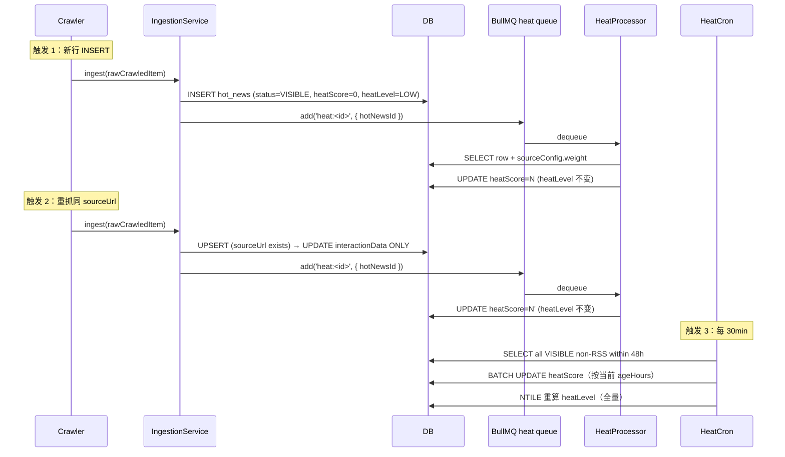

# SP-6 — 热度分计算

- **状态**：spec 待用户审阅
- **依赖**：
  - SP-3（Reddit）/ SP-2（HN）/ SP-1（RSS）已完成 —— `interactionData` 各平台字段名稳定（HN: `score / comments`；Reddit: `score / comments / redditUpvoteRatio`；Twitter SP-22: `likes / retweets / replies`）
  - SP-4 quality 过滤已就位 —— heat 仅对 `status='VISIBLE'` 行计算
  - SP-5 v3.4 摘要管线 —— `interactionData` upsert 与 `summary:<id>` push 互不干扰
  - SP-5.5（前 commit `7635599`，已追溯重命名）—— `trustedSource` 字段不影响 heat 计算公式
  - 一次性脚本范式（SP-4 §10 决策 11）—— 本 SP 不需要新建一次性脚本，但若要后续手动重算可循同款范式
- **本文件**：`docs/superpowers/specs/2026-05-09-sp6-heat-score-design.md`
- **预计工作量**：~1.5 天（worker `heat/` 模块 + ingestion upsert 改造 + API sort + 30 个测试）
- **拆分**：3 个 PR（schema → API → worker）

---

## 0. 关键设计决策（已在 brainstorming 阶段拍板）


| #   | 维度                   | 选择                                                                                                | 理由                                                                    |
| --- | -------------------- | ------------------------------------------------------------------------------------------------- | --------------------------------------------------------------------- |
| Q1  | 公式范围                 | **4 维**（时间衰减 25% + 互动 35% + 源权重 25% + 跨平台传播 15%）；RSS 单独板块不参与                                      | PRD 6 维公式中关键词匹配 / 用户监控两维需用户系统（V1 单用户无意义）；跨平台传播由 SP-7 提供 `groupId`     |
| Q2  | 平台覆盖                 | **HN + Reddit V1 enable；Twitter SP-22 启用；RSS 永不参与**                                               | RSS 走"权威媒体"独立板块（已有 `?tab=media`）；Twitter 字段已在 `interactionData` 字段名约定 |
| Q3  | 互动信号归一化              | **log10**（`log10(raw + 1) / log10(MAX + 1) * 100`）+ 平台 MAX 上限 env 化                               | 互动数分布幅度大（HN 1-1000+，Reddit 1-13000）；线性归一会被极值压死                        |
| Q4  | `interactionData` 刷新 | **改 ingestion 为 upsert**（同 sourceUrl 第二次抓 → UPDATE `interactionData`，其它字段保留）+ 同时 push `heat:<id>` | first-write-wins 会让热点新闻热度永远定格在首抓 score；用现有抓取节奏自然刷新，不新增 worker         |
| Q5  | 时间衰减                 | **指数衰减**：`exp(-ageHours / 48) * 100`；30min cron 全量重算                                              | 50% 半衰约 33h，与 PLATFORM_WINDOW_HOURS=48 配合；30min 间隔在数据量 N=200/天 下成本可忽略 |
| Q6  | weight 默认            | **SourceConfig.weight 全 0.5**（V1）                                                                 | 没数据可分级；先跑两周看 BURST 分布再调                                               |
| Q7  | heatLevel 阈值         | **NTILE(4) 相对百分位**：BURST=top 5% / HOT=15% / NORMAL=30% / LOW=50%                                  | PRD 绝对阈值（90/70/40）在 V1 公式上限 72.5 时 BURST 永不可达；相对分位保证 4 色分布稳定          |
| Q8  | V1 HeatBadge         | **不加**，纯 API ready                                                                                | Aurora 视觉系统是 SP-8 范畴；V1 加 HeatBadge 会与 Aurora 冲突                      |
| Q9  | V1 sort UI           | **不加**，URL 手拼 `?sort=heat` 可用                                                                     | SP-9 Dashboard 是该 toggle 的自然位置                                        |
| Q10 | weight 默认值           | **A · 全 0.5**                                                                                     | 同 Q6                                                                  |
| Q11 | 部署                   | **3 个 PR**（schema → API → worker）                                                                 | 小 PR review 友好；每步可独立回滚                                                |
| Q12 | Liveness             | **不加** heat-cron-alive touch 文件                                                                   | YAGNI；监控可用 `psql 查 heatLevel 分布`间接验证                                  |


---

## 1. 目标与硬验收标准

### 1.1 目标

让 `HotNews.heatScore`（Float 0-100）和 `HotNews.heatLevel`（enum）这两个 schema 已就位的字段被**真实计算 + 持续刷新**，并通过 `GET /hot-news?sort=heat` 端点暴露给下游（SP-9 Dashboard / Aurora SP-8 / 后续 SP-10 列表重做）。

```
http://hotnews.shinpeionline.top/api/hot-news?platforms=HACKERNEWS,REDDIT&sort=heat&pageSize=20
→ 返回按 heatScore desc 排序的 20 行，每行附 heatScore + heatLevel
```

### 1.2 In-scope


| 模块                                                                             | 新增/改动                                                                                                                                                                            |
| ------------------------------------------------------------------------------ | -------------------------------------------------------------------------------------------------------------------------------------------------------------------------------- |
| `apps/worker/src/heat/`（新增模块）                                                  | `heat.module.ts` / `heat.queue.ts` / `heat.processor.ts` / `heat.service.ts` / `heat.cron.ts` / `heat.cron.processor.ts` / `interaction-signal.ts` / `heat.config.ts` + 4 个 spec |
| `apps/worker/src/crawl/ingestion.service.ts`                                   | first-write-wins → upsert（仅刷 `interactionData`，其他字段不动）；INSERT + upsert UPDATE 后均 push `heat:<id>`                                                                                |
| `apps/worker/src/worker.module.ts`                                             | imports 加 `HeatModule`                                                                                                                                                           |
| `packages/db/prisma/schema.prisma`                                             | `SourceConfig` 加 `weight Float @default(0.5)`                                                                                                                                    |
| `packages/db/prisma/migrations/20260509094500_sp6_source_weight/migration.sql` | 单列 ADD COLUMN                                                                                                                                                                    |
| `packages/types/src/dtos.ts`                                                   | `HotNewsListItemDto` 加 `heatScore: number | null` + `heatLevel: HeatLevel | null`                                                                                                |
| `apps/api/src/hot-news/dto/list-hot-news.query.ts`                             | 加 `sort?: 'time' | 'heat'`                                                                                                                                                       |
| `apps/api/src/hot-news/hot-news.service.ts`                                    | `list()` 接 `sort` 参数；`sort='heat'` 时 RSS 过滤 + orderBy 切换 + select 加 heatScore/heatLevel                                                                                          |
| `apps/api/src/hot-news/hot-news.controller.ts`                                 | 透传 `query.sort`                                                                                                                                                                  |
| `.env.example` + `docker-compose.prod.yml`                                     | 加 `HEAT_*` + `INTERACTION_MAX_*` env                                                                                                                                             |


### 1.3 Out-of-scope（明确不做）

- ❌ HeatBadge UI 渲染 → SP-8 Aurora 落地时
- ❌ `?sort=heat` 的 toggle/tab UI → SP-9 Dashboard
- ❌ heat 历史时序表（按小时/天聚合）→ SP-19
- ❌ heat 触发的关键词命中通知 → SP-13
- ❌ per-source weight 调优 → V1 全 0.5；SP-6 后两周观察再开 follow-up
- ❌ 独立 `refresh-interaction-data` worker（SP-2/3 spec 提过）→ Q4 决定走 ingestion upsert，无需独立 worker
- ❌ Liveness check / 主动告警 → Q12 YAGNI
- ❌ 关键词监控 / 用户偏好维度 → 待用户系统 SP-13
- ❌ 跨平台传播分（dimension 4）的实际计算 → V1 占位为 0；待 SP-7 落地后填值
- ❌ heatScore 公式在 V1 上限不到 100 这件事不"修"（不强行 normalize），加 SP-7 后自然到 100

### 1.4 硬验收标准

```bash
# 1. Local
pnpm turbo run lint typecheck test
# 全绿；新增 ~30 vitest case；ingestion.service.spec.ts invert "first-write-wins" → "upsert"

# 2. Prod schema migration（PR-1 部署后）
ssh ai-hot-news-prod 'cd /srv/ai-hot-news && docker compose -f docker/docker-compose.prod.yml --env-file .env exec -T postgres \
  psql -U ai_hot_news -d ai_hot_news_prod -c "\d source_configs" | grep weight'
# 输出含 `weight | double precision | not null default 0.5`

# 3. Prod data invariant: cron 跑过一轮后 (PR-3 deploy + 30min 内)
ssh ai-hot-news-prod 'cd /srv/ai-hot-news && docker compose -f docker/docker-compose.prod.yml --env-file .env exec -T postgres \
  psql -U ai_hot_news -d ai_hot_news_prod -c "SELECT COUNT(*) FILTER (WHERE \"heatScore\" > 0 AND \"sourcePlatform\" != '\''RSS'\'') AS has_heat, COUNT(*) FILTER (WHERE \"heatScore\" = 0 AND \"sourcePlatform\" != '\''RSS'\'') AS no_heat FROM hot_news WHERE \"publishedAt\" > now() - interval '\''48 hours'\'' AND status='\''VISIBLE'\'';"'
# 期望 has_heat ≥ 100 / no_heat = 0（boot backstop 已 catch up）

# 4. heatLevel 分布
ssh ai-hot-news-prod 'cd /srv/ai-hot-news && docker compose -f docker/docker-compose.prod.yml --env-file .env exec -T postgres \
  psql -U ai_hot_news -d ai_hot_news_prod -c "SELECT \"heatLevel\", COUNT(*) FROM hot_news WHERE \"publishedAt\" > now() - interval '\''48 hours'\'' AND \"sourcePlatform\" != '\''RSS'\'' AND status='\''VISIBLE'\'' GROUP BY 1 ORDER BY 1;"'
# 期望 (N=200 时): BURST≈10 / HOT≈30 / NORMAL≈60 / LOW≈100；NTILE 在小数据下允许 ±5 行误差

# 5. API sort=heat smoke
curl 'https://hotnews.shinpeionline.top/api/hot-news?platforms=HACKERNEWS,REDDIT&sort=heat&pageSize=10' | jq '.items[] | {heatScore, heatLevel, sourcePlatform, title}' | head -30
# 第一行 heatScore 应 > 第十行；无 RSS 行；heatLevel 字段非 null

# 6. interactionData 真的 refresh（IngestionService upsert 生效）
# IngestionService 在 upsert 路径打 log "[Ingest] ... upserted=N (interactionData refreshed)"；
# 跑两轮 crawl 后看 worker log：
ssh ai-hot-news-prod 'cd /srv/ai-hot-news && docker compose -f docker/docker-compose.prod.yml --env-file .env logs --tail 200 worker | grep upserted='
# 期望某些 source 出现 upserted>=1 的行（HN top 60min crawlInterval 内即可观察到）
```

> **注**：`HotNews` 表当前没有 `updatedAt` 列，所以无法用 `WHERE updatedAt > X` 直接 SQL 验。SP-6 在 IngestionService upsert 路径加一行 log（`upserted=N`），acceptance 6 用 worker log grep 验证。如果未来需要 SQL 层时间戳查询，按 §11 升级钩子加 `updatedAt DateTime @updatedAt` 单列 migration。

---

## 2. 热度公式

### 2.1 V1 4 维公式

```typescript
function computeHeatScore(
  row: { sourcePlatform: Platform; publishedAt: Date; interactionData: Record<string, unknown> | null },
  sourceWeight: number,           // SourceConfig.weight, 0.0-1.0
  now: Date,
): number {
  if (row.sourcePlatform === 'RSS') return 0;        // RSS 走独立板块，不参与热度

  const ageHours        = (now.getTime() - row.publishedAt.getTime()) / 3_600_000;
  const timeScore       = Math.exp(-ageHours / DECAY_TAU_HOURS) * 100;          // 0-100
  const interactionScore = interactionSignal(row.sourcePlatform, row.interactionData); // 0-100
  const sourceScore     = sourceWeight * 100;                                   // 0-100
  const crossPlatformScore = 0;                                                  // V1 占位；SP-7 落地后由 groupId 计算

  return (
    timeScore           * 0.25 +
    interactionScore    * 0.35 +
    sourceScore         * 0.25 +
    crossPlatformScore  * 0.15
  );
}
```

V1 输出范围 0-72.5（cross-platform 维度恒为 0 时）；SP-7 落地后 → 0-100。

### 2.2 互动信号（per-platform log normalization）

```typescript
function interactionSignal(
  platform: Platform,
  data: Record<string, unknown> | null,
): number {
  if (!data) return 0;

  switch (platform) {
    case 'HACKERNEWS': {
      const raw = (Number(data.score) || 0) + (Number(data.comments) || 0) * 2;
      return normalizeLog(raw, MAX_HN);              // MAX_HN=500 (env)
    }

    case 'REDDIT': {
      const ratioWeight = Math.max(Number(data.redditUpvoteRatio) || 0.5, 0.5);   // null/<0.5 都按 0.5
      const raw = ((Number(data.score) || 0) + (Number(data.comments) || 0) * 2) * ratioWeight;
      return normalizeLog(raw, MAX_REDDIT);          // MAX_REDDIT=5000 (env)
    }

    case 'TWITTER': {                                 // SP-22 启用
      const raw = (Number(data.likes) || 0)
                + (Number(data.retweets) || 0) * 3
                + (Number(data.replies) || 0) * 2;
      return normalizeLog(raw, MAX_TWITTER);         // MAX_TWITTER=100000 (env)
    }

    case 'RSS':
      throw new Error('RSS rows must be filtered before interactionSignal()');
  }
}

function normalizeLog(raw: number, max: number): number {
  return Math.log10(raw + 1) / Math.log10(max + 1) * 100;
}
```

### 2.3 heatLevel（NTILE 相对百分位）

```sql
-- 30min cron 全量重算时执行（在事务内）
WITH ranked AS (
  SELECT id, NTILE(20) OVER (ORDER BY "heatScore" DESC) AS bucket
  FROM hot_news
  WHERE status = 'VISIBLE'
    AND "sourcePlatform" != 'RSS'
    AND "publishedAt" > now() - interval '48 hours'
)
UPDATE hot_news h
SET "heatLevel" = CASE
  WHEN r.bucket = 1                  THEN 'BURST'      -- top 5%
  WHEN r.bucket BETWEEN 2 AND 4      THEN 'HOT'        -- next 15%
  WHEN r.bucket BETWEEN 5 AND 10     THEN 'NORMAL'     -- next 30%
  ELSE                                    'LOW'         -- bottom 50%
END
FROM ranked r
WHERE h.id = r.id;
```

**RSS 行不动**（保留 schema 默认 `LOW`）。

---

## 3. 数据流（3 个 heat 写入触发）




### 3.1 一致性 trade-off：单行写不刷 heatLevel

**已知弱一致性**：触发 1/2 只 UPDATE 单行的 `heatScore`，不重新计算 `heatLevel`。原因：

- 单行 `heatLevel` 重算需要再做一次全量 NTILE → 30 个并发 INSERT 会触发 30 次全表扫，浪费
- `heatLevel` 是用于 UI 着色的"相对档位"，30 分钟延迟可接受
- 触发 3（cron）会兜底刷新 → 用户最多看到 30 分钟前的 `heatLevel`

**接受**。如果未来用户报怨"BURST 标签很滞后"，可考虑：

- 缩短 cron 到 10 分钟（成本仍可控，N=200 行 UPDATE ≈ 20ms）
- 或在单行 UPDATE 时仅当 `heatScore` 超过当前 BURST 下限时主动改 `heatLevel='BURST'`（半精确，不重算其它行）

V1 不做。

### 3.2 Boot backstop

`HeatModule.OnApplicationBootstrap`：

```typescript
async onApplicationBootstrap() {
  const queue = this.heatQueue;
  await queue.clean(0, 0, 'failed');     // SP-5 c64fe93 教训
  await queue.clean(0, 0, 'completed');  // SP-5 c1886f3 教训

  const pending = await this.prisma.hotNews.findMany({
    where: {
      status: 'VISIBLE',
      sourcePlatform: { not: 'RSS' },
      publishedAt: { gte: new Date(Date.now() - 48 * 3600 * 1000) },
      heatScore: 0,        // 还没算的
    },
    select: { id: true },
  });

  for (const { id } of pending) {
    await queue.add('heat', { hotNewsId: id }, { jobId: `heat-${id}` });
  }
  this.logger.log(`Boot backstop: re-queued ${pending.length} pending heat jobs`);
}
```

**为什么 `heatScore=0`** 而不是 `heatScore IS NULL`：schema 是 `Float @default(0)` 非 nullable，新插入的行是 0；boot 后扫这些 0 重算。已经计算过且结果 > 0 的行不会被重新入队（避免 worker 重启时大批量 thrash）。

**Edge case**：如果某行真实 heatScore 计算结果就是 0（极冷帖 + age >> tau），boot backstop 会反复重算 —— 接受，单行 compute 成本 ~5ms。

---

## 4. 模块结构

```
apps/worker/src/heat/                              ★ 新增模块
├── heat.module.ts                                 # NestJS module + OnApplicationBootstrap (boot backstop)
├── heat.queue.ts                                  # HEAT_QUEUE_NAME='heat' / HEAT_QUEUE token / queueProvider / HEAT_WORKER + factory
├── heat.processor.ts                              # processHeatJob({ hotNewsId }, service)
├── heat.service.ts                                # HeatService.run(hotNewsId): SELECT row + sourceConfig.weight → compute → UPDATE heatScore
├── heat.cron.ts                                   # OnModuleInit registers BullMQ repeat job 'heat-refresh' (every HEAT_CRON_INTERVAL_MIN min)
├── heat.cron.processor.ts                         # processHeatRefreshJob(service): batch UPDATE heatScore + NTILE recalc heatLevel
├── interaction-signal.ts                          # interactionSignal(platform, data) → 0-100 (含 normalizeLog)
├── heat.config.ts                                 # 读 HEAT_* / INTERACTION_MAX_* env
├── heat.service.spec.ts
├── heat.cron.spec.ts
├── heat.module.spec.ts                            # boot backstop test (镜像 summarize.module.spec.ts)
└── interaction-signal.spec.ts

apps/worker/src/crawl/ingestion.service.ts        ★ 修改
├── first-write-wins → upsert（only interactionData; other fields preserved by Prisma update merge）
├── INSERT 后 push heat:<id>
├── upsert UPDATE 后 push heat:<id>
└── (test) invert "does NOT overwrite interactionData on duplicate sourceUrl"
       → "DOES upsert interactionData on duplicate sourceUrl, preserves other fields"

apps/worker/src/worker.module.ts                  ★ 修改
└── imports: [..., HeatModule]
```

### 4.1 跟 SP-5 SummarizeModule 的对比


|                    | SummarizeModule     | HeatModule                                                             |
| ------------------ | ------------------- | ---------------------------------------------------------------------- |
| 触发频次               | ingest 后一次（per row） | ingest 后一次（INSERT）+ upsert 后一次（重抓）+ cron 全量（30min）                     |
| 输入字段               | `title + content`   | `interactionData + sourcePlatform + publishedAt + sourceConfig.weight` |
| 外部依赖               | LLM API（OpenRouter） | 无（纯计算）                                                                 |
| 重试策略               | LLM 失败后入 failed 队列  | 计算失败几无可能（输入纯本地）；失败仅在 DB 写入异常时                                          |
| Boot backstop 扫的字段 | `summary IS NULL`   | `heatScore = 0 AND publishedAt > now-48h AND sourcePlatform != 'RSS'`  |
| 计算成本               | 1-3s/row（LLM RTT）   | <5ms/row（in-process Math）                                              |


---

## 5. Schema migration

### 5.1 schema.prisma 改动

```prisma
model SourceConfig {
  id             String       @id @default(cuid())
  platform       Platform
  name           String
  url            String?
  identifier     String?
  enabled        Boolean      @default(true)
  crawlInterval  Int          @default(1800)
  lastCrawledAt  DateTime?
  status         SourceStatus @default(NORMAL)
  errorMessage   String?
  weight         Float        @default(0.5)         // ★ NEW (SP-6)
  createdAt      DateTime     @default(now())
  updatedAt      DateTime     @updatedAt

  @@index([platform, enabled])
  @@unique([platform, url])
  @@map("source_configs")
}
```

### 5.2 Migration SQL

`packages/db/prisma/migrations/20260509094500_sp6_source_weight/migration.sql`：

```sql
ALTER TABLE "source_configs" ADD COLUMN "weight" DOUBLE PRECISION NOT NULL DEFAULT 0.5;
```

DEFAULT 0.5 在 ADD COLUMN 时自动 backfill 所有现有 prod 行（HN top/ask/show + Reddit bundle + 7 个 RSS 源 = 11 行）。

### 5.3 seed.ts 不动

新源走默认 0.5。运营要调权重时直接 SQL UPDATE 或写一次性脚本（不在 SP-6 范围）。

---

## 6. API 改动

### 6.1 DTO 字段（`packages/types/src/dtos.ts`）

```typescript
export interface HotNewsListItemDto {
  // ... existing fields ...

  /**
   * SP-6 (2026-05-09): Heat score 0-100 (V1 caps at 0-72.5; reaches 0-100
   * once SP-7's crossPlatformScore lands). Always 0 for RSS rows (excluded
   * from heat ranking; see HotNewsService heat-sort path). DTO type allows
   * null for forward-compat: if V2 schema makes the column nullable to
   * distinguish "uncomputed" vs "computed=0", DTO needn't change.
   */
  heatScore: number | null;

  /**
   * SP-6 (2026-05-09): Categorical heat tier from NTILE(20)→4-way bucket
   * over the 48h non-RSS VISIBLE window. BURST=top 5% / HOT=next 15% /
   * NORMAL=next 30% / LOW=bottom 50%. Recalculated globally on the
   * 30-min cron; single-row writes do NOT refresh heatLevel (see spec
   * §3.1 weak-consistency trade-off). Frontend uses for color coding
   * (Aurora SP-8 / Dashboard SP-9).
   */
  heatLevel: 'BURST' | 'HOT' | 'NORMAL' | 'LOW' | null;
}
```

### 6.2 ListHotNewsQuery（`apps/api/src/hot-news/dto/list-hot-news.query.ts`）

```typescript
const ALLOWED_SORTS = ['time', 'heat'] as const;
type AllowedSort = (typeof ALLOWED_SORTS)[number];

export class ListHotNewsQuery {
  // ... existing fields (page / pageSize / platforms) ...

  @IsOptional()
  @Transform(({ value }: { value: unknown }) =>
    typeof value === 'string' ? value.trim().toLowerCase() : value,
  )
  @IsIn(ALLOWED_SORTS)
  sort?: AllowedSort;
}
```

### 6.3 HotNewsService（`apps/api/src/hot-news/hot-news.service.ts`）

```typescript
async list(
  page: number,
  pageSize: number,
  platforms?: Platform[],
  sort: 'time' | 'heat' = 'time',
): Promise<HotNewsListResponseDto> {
  const prisma = getPrisma();
  const skip = (page - 1) * pageSize;
  const now = new Date();

  // Heat sort excludes RSS by contract — SP-6 §0 Q1/Q2.
  const requested = platforms?.length ? platforms : DEFAULT_PLATFORMS;
  const effectivePlatforms = sort === 'heat'
    ? requested.filter((p) => p !== 'RSS')
    : requested;

  if (effectivePlatforms.length === 0) {
    return { items: [], page, pageSize, total: 0 };
  }

  const orClauses = effectivePlatforms.map((p) => ({
    sourcePlatform: p,
    publishedAt: { gte: new Date(now.getTime() - PLATFORM_WINDOW_HOURS[p] * 60 * 60 * 1000) },
  }));
  const where = { status: ContentStatus.VISIBLE, OR: orClauses };

  const orderBy = sort === 'heat'
    ? [{ heatScore: 'desc' as const }, { publishedAt: 'desc' as const }]
    : [{ publishedAt: 'desc' as const }];

  const [rows, total] = await prisma.$transaction([
    prisma.hotNews.findMany({
      where,
      skip,
      take: pageSize,
      orderBy,
      select: {
        // ... existing fields ...
        heatScore: true,    // ★ NEW
        heatLevel: true,    // ★ NEW
      },
    }),
    prisma.hotNews.count({ where }),
  ]);

  return {
    items: rows.map((r) => ({
      // ... existing field passthrough ...
      heatScore: r.heatScore,
      heatLevel: r.heatLevel,
    })),
    page,
    pageSize,
    total,
  };
}
```

### 6.4 Controller（`apps/api/src/hot-news/hot-news.controller.ts`）

```typescript
@Get('hot-news')
async list(@Query() query: ListHotNewsQuery): Promise<HotNewsListResponseDto> {
  return this.service.list(query.page, query.pageSize, query.platforms, query.sort);
}
```

---

## 7. Web 改动

### 7.1 V1 故意 minimal —— 不动 UI

- `news-item.tsx` **不渲染** `heatScore` / `heatLevel`（保持现有简洁卡片设计）
- `feed-tabs.tsx` **不加** sort toggle（无 `?sort=heat` UI 入口）
- `fetchHotNewsList` **自动**透传新字段（DTO 类型一改，typecheck 强制 prop 通畅；无需手动改 fetch）

### 7.2 SP-8/9 落地后

- Aurora SP-8 提供 4 色调色板（BURST/HOT/NORMAL/LOW），`news-item.tsx` 加 `<HeatBadge level={item.heatLevel} score={item.heatScore} />`
- Dashboard SP-9 加 `?sort=heat` toggle 或独立"热度榜"区块
- 详情页 SP-11 显示 heatScore 数值 + 历史 heat 曲线（需 SP-19 时序聚合）

---

## 8. 测试矩阵


| 文件                                                             | 类型          | 关键 case                                                                                                                                                  | 数量  |
| -------------------------------------------------------------- | ----------- | -------------------------------------------------------------------------------------------------------------------------------------------------------- | --- |
| `apps/worker/src/heat/interaction-signal.spec.ts`              | unit        | HN 0/0→0；HN 100/20→~~62；HN 10000/2000→~~95；Reddit ratio=null fallback 0.5；Reddit ratio=0.4 dampens；Twitter placeholder；RSS throws                        | ~10 |
| `apps/worker/src/heat/heat.service.spec.ts`                    | unit        | timeScore 1h≈98 / 24h≈61 / 48h≈37 / 7d≈4；sourceWeight 0.5/1.0 → 12.5/25；RSS row → 0 (early return)；整公式 known-input correctness（已知 input → 已知 output 验数学） | ~8  |
| `apps/worker/src/heat/heat.cron.spec.ts`                       | unit        | batch UPDATE in single TX；NTILE on 100 rows → BURST=5/HOT=15/NORMAL=30/LOW=50；empty table no-op；cron interval correct                                    | ~5  |
| `apps/worker/src/heat/heat.module.spec.ts`                     | unit        | boot backstop scans correct WHERE clause；queue.clean 'failed' + 'completed' 前置；jobId dedup safe；镜像 summarize.module.spec.ts                              | ~3  |
| `apps/worker/src/crawl/ingestion.service.spec.ts`              | unit        | **invert** 旧 case → "DOES upsert interactionData on duplicate sourceUrl, preserves other fields"；INSERT 后 push heat:；upsert UPDATE 后 push heat:          | +3  |
| `apps/worker/src/heat/heat.cron.processor.integration.spec.ts` | integration | 真实 DB 100 行 cron → NTILE 分布 ±2 误差；sourceWeight JOIN 正确；transaction 原子性                                                                                   | ~3  |
| `apps/worker/src/crawl/ingestion.service.integration.spec.ts`  | integration | 加 case：第二次 ingest 同 sourceUrl + 不同 interactionData → DB 行 interactionData UPDATE / publishedAt+title 不动                                                  | +1  |


合计 +30 case。

### 8.1 测试隔离

- 单元测试用 `prismaMock`（已有 pattern）
- Integration 测试走 `packages/db/test/setup-env.ts` + `fileParallelism=false`（已有 `vitest.config.ts` 设定）
- BullMQ 队列在测试里用 `redis://localhost:6379/15`（已有 `apps/worker/test/setup-env.ts` pattern）

---

## 9. Env vars + 部署

### 9.1 新 env vars

```sh
# .env.example + docker-compose.prod.yml worker.environment
HEAT_DECAY_TAU_HOURS=48          # exp(-ageHours / tau)
HEAT_CRON_INTERVAL_MIN=30        # global NTILE recalc cadence
HEAT_BATCH_SIZE=500              # rows per cron batch
HEAT_CONCURRENCY=2               # BullMQ heat:<id> worker concurrency
INTERACTION_MAX_HN=500           # log normalizer ceiling per platform
INTERACTION_MAX_REDDIT=5000
INTERACTION_MAX_TWITTER=100000   # SP-22 enables; placeholder OK in V1
```

按 SP-4.7 PR #3 教训，`docker-compose.prod.yml` worker.environment 段必须**显式逐个透传** `${VAR}`。

### 9.2 3 PR 部署链


| PR                | 内容                                                                                                                                                                                   | 部署 risk                                                                           | 回滚                                                      |
| ----------------- | ------------------------------------------------------------------------------------------------------------------------------------------------------------------------------------ | --------------------------------------------------------------------------------- | ------------------------------------------------------- |
| **PR-A · schema** | `schema.prisma` 改动 + migration.sql                                                                                                                                                   | 极低（仅 ADD COLUMN with DEFAULT，对现有 prod 行 idempotent backfill）                      | `prisma migrate resolve --rolled-back` + 手动 DROP COLUMN |
| **PR-B · API**    | types DTO + query DTO + service sort + controller + 对应 spec                                                                                                                          | 低（worker 还没写 heatScore，API 返回的 heatScore 全是 0；前端不变；外部 client 多两个无害字段）             | Revert PR                                               |
| **PR-C · worker** | `apps/worker/src/heat/` 完整模块 + ingestion upsert（含 `upserted=N` log）+ worker.module imports + ingestion.service.spec invert + 7 个新 spec + .env + compose + decomposition.md §11 entry | 中（ingestion 写路径改动；upsert 需要测试覆盖；boot backstop 启动后会大量入队 ~~300 行 heat 计算，~~15s 内完成） | Revert PR + worker 重启会消化残留队列                            |


部署顺序：PR-A merge → wait migration auto-deploy → PR-B merge → wait deploy → smoke test API DTO 字段 ready → PR-C merge → wait deploy → smoke test heatScore ramp up。

### 9.3 一次性"启动重算"操作

PR-C 部署后 boot backstop 会自动扫 48h 窗口内 `heatScore=0` 的行入队。预期 30 秒内全部算完。无需手工脚本。

---

## 10. 风险登记


| 风险                                     | 影响                                     | 缓解                                                                                                                                                                     |
| -------------------------------------- | -------------------------------------- | ---------------------------------------------------------------------------------------------------------------------------------------------------------------------- |
| Cron 挂掉，`heatLevel` 长期失真               | UI 颜色比例失衡                              | docker `restart: unless-stopped` 兜底；30min 间隔宽容；`psql` 查 `heatLevel` 分布间接监控（YAGNI Liveness check）                                                                       |
| BullMQ jobId dedupe 吞 heat:            | 单行重算被无声跳过                              | `HeatModule` boot backstop `queue.clean(0,0,'failed')+'completed'`（直接复用 c64fe93 + c1886f3 修复模式）                                                                        |
| RSS 被纳入 heat 排序                        | 违反 §0 Q2 决策                            | **3 层运行时防护**：(1) service 层 `platforms.filter(p !== 'RSS')`；(2) compute 函数 RSS 早 return 0；(3) cron NTILE WHERE 子句过滤 RSS。**1 层验证**：测试覆盖 `?sort=heat&platforms=RSS` → 空结果 |
| `interactionData` upsert 覆盖错数据         | crawler bug 用错数据污染 score               | crawler 端 quality 检查（SP-4 + SP-5.5）已有兜底；upsert 仅对 quality 通过的 VISIBLE 行触发                                                                                              |
| weight=0.5 全员均匀，sourceScore 退化         | sourceScore 维度对 ranking 无贡献（恒定 12.5 分） | **设计已知**：等价于"减少 timeScore+interactionScore 相对差距 12.5 分"；等观察后调 weight 修正                                                                                                |
| NTILE 在小数据量不稳                          | 早期 BURST 标签每天 1-3 个                    | NTILE(N) 在 N < 20 时退化为均匀分布；接受，prod 数据量上来后趋稳                                                                                                                            |
| `interactionData.score=0` 时被 log10 拉到底 | 第一次抓时表现冰冷                              | 重抓 / cron 后会更新；30min 内瞬态低分可接受                                                                                                                                          |
| 加 `weight` 列的 ALTER TABLE 在 prod 阻塞    | 写锁短暂                                   | `ADD COLUMN ... DEFAULT 0.5` 在 PG 11+ 是 metadata-only operation（O(1)），无 row rewrite；可忽略                                                                                |
| heat 队列堆积（如 ingest 突然涌入 1000 行）        | BullMQ wait 集合堆积                       | `HEAT_CONCURRENCY=2`（可调高）；单 row compute ~5ms，1000 行 ~2.5s 消化；BullMQ wait 集合无 hard cap                                                                                  |
| heatScore 浮点比较测试 flaky                 | snapshot test 不通过                      | 用 `expect(score).toBeCloseTo(N, 1)` 而非精确等值；公式分量分别测确认精度边界                                                                                                               |


---

## 11. 升级钩子（明确未来 SP 接入点）

- **SP-7（pgvector 跨平台合并）落地后**：`computeHeatScore` 内 `crossPlatformScore = computeFromGroupId(row.groupId)`，公式自动 0-100 满量程。新增 `apps/worker/src/heat/cross-platform-score.ts` 单文件 + 单 spec；`heat.service.ts` 多注入 `groupSize` 一行查询。
- **SP-22（Twitter 抓取）启用后**：`interaction-signal.ts` Twitter case 从 placeholder（已写）转活；env `INTERACTION_MAX_TWITTER` 的 100000 上限按观察调。
- **SP-13（关键词监控）落地后**：公式加第 5 维 `userKeywordScore`（按 `KeywordHit` 表的命中数权重），重新 normalize 4 维权重为 5 维。
- **SP-19（时序聚合）落地后**：HotNews 加 `heatScoreHistory` 关联表（每小时一行），`heat.cron.ts` 写入历史快照。
- **SourceConfig.weight 调优 follow-up**（V1+2 周）：基于 prod NTILE 分布观察，对明显"权威源"（OpenAI Blog 等）+0.2，对"嘈杂源"（某些 sub）-0.1，写一个 `tune-source-weight-v1.ts` 一次性脚本（按 SP-4 §10 决策 11 范式）。
- `**HotNews.updatedAt` 列**（acceptance 6 用到）：当前 schema 没有，spec 验收时改用 worker log diff 比对 interactionData。如果未来需要"行级时间戳"可加 `updatedAt DateTime @updatedAt` 单列 migration。
- **heatScore null 语义**：若未来想区分"未计算 (NULL)" vs "计算后是 0 (RSS / 极冷)"，schema 改 `Float?`；DTO 已经是 `number | null` 不用动。
- **Liveness check**（Q12 跳过）：若 cron 挂掉过 1 次，按 SP-4.7 LivenessService 模式加 `apps/worker/src/heat/heat-liveness.service.ts`，touch `/tmp/heat-cron-alive`；docker compose healthcheck 读这个文件。

---

## 12. 与 PRD 公式的对照

PRD 给的 6 维公式：

```
H = w_t × T(t) + w_i × I(p) + w_s × S(s) + w_c × C(c) + w_k × K(p,k) + w_m × M(p,u)
```


| 维度        | PRD 权重       | V1 实现                           | V2/未来              |
| --------- | ------------ | ------------------------------- | ------------------ |
| `T` 时间衰减  | 25%          | ✅ `exp(-ageHours/48) * 100`     | —                  |
| `I` 互动    | 35%          | ✅ per-platform log-normalized   | 微调 MAX_*           |
| `S` 源权重   | 25%          | ✅ `weight * 100`（V1 全 0.5 → 50） | 调 weight           |
| `C` 跨平台传播 | 15%          | ⏳ V1 占位 0                       | SP-7 提供 groupId 后填 |
| `K` 关键词匹配 | (PRD 未给具体权重) | ❌ V1 砍掉                         | SP-13 用户系统后加       |
| `M` 用户监控  | (同上)         | ❌ V1 砍掉                         | SP-13 同上           |


**V1 加和 = 100%（4 维归一化），V2/SP-7 后保持 100% 不变**（`C` 维度从 0 → 实际值）。SP-13 加 `K + M` 时重新归一为 100%（4 维权重等比例缩小）。

---

## 13. brainstorming 阶段产出 / 非决策项备忘

- **HotNews schema 已有 `heatScore` / `heatLevel` / `@@index([heatScore(sort: Desc)])*`*：SP-6 不需要 schema 改这三个字段，仅需要"真的写入"。
- **HotNews.heatLevel 默认 LOW**：V1 RSS 行永远是 LOW（cron 不更新 RSS）。
- **HotNews.embedding 列已就位**（SP-7 用，SP-6 不动）。
- `**HotNews.groupId` 已就位**（SP-7 用，SP-6 V1 占位 0）。
- **SP-5.5（前 commit `7635599 feat(sp6)` 已追溯重命名）的 `trustedSource` 字段不影响 heat**：它只决定 row 是否进 VISIBLE，不影响公式输入。SP-5.5 的内容质量过滤是 SP-6 的"上游已就绪"前提。
- **decomposition.md §11 已写入 SP-5.5 entry**（commit `17c6b8b`）。SP-6 落地时 §11 加 SP-6 entry。
- **不重命名 git 分支**（`sp6/value-signal-filter` 是 SP-5.5 的历史分支，已 reset 回 origin；SP-6 启动时新建 3 个 PR 各自独立分支）。

---

## 14. brainstorming 决策日志

13 个决策来源（按问答顺序）：

1. **Q1 公式范围 = 4 维**（用户原话："stay_b" 拒绝 SP-6 Lite 选项 C，确认完整 4 维）
2. **Q2 RSS 走独立板块 + Twitter 后续支持**（用户原话："RSS 到时候走独立的板块，不参与热度榜单。另外后续不止 HN/Reddit 还有 X 上的内容要考虑进去"）
3. **Q3 互动信号 = log10**（用户选 `log_default`）
4. **Q4 ingestion upsert interactionData**（用户选 `b_upsert`）
5. **Q5 时间衰减 exp / cron 30min**（用户选 `exp48_cron30`）
6. **Q6/Q10 weight 全 0.5**（用户两次都选 YAGNI）
7. **Q7 heatLevel 相对百分位**（用户选 `relative`）
8. **Section 1 设计 OK**（用户："ok"）
9. **Q8 V1 不加 HeatBadge**（用户选 `no_badge`）
10. **Q9 V1 不加 sort UI**（用户选 `no_sort_ui`）
11. **Q11 3-PR 部署**（用户选 `three_prs`）
12. **Q12 不加 Liveness**（用户选 `no_liveness`）
13. **Q13 写 spec**（用户选 `write`）

